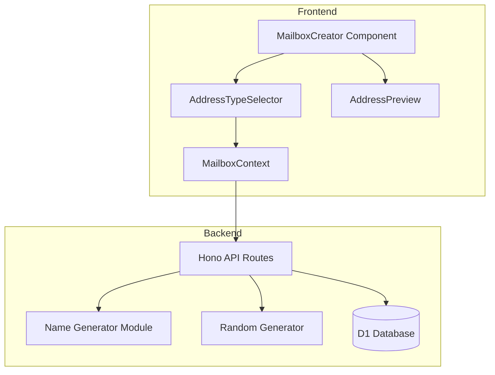

# Design Document: English Name Generator

## Overview

本设计文档描述了ZMAIL临时邮箱系统的英文名邮箱生成器功能。该功能允许用户在创建邮箱时选择三种地址生成方式：英文名、随机或自定义输入。

系统采用前后端分离架构：
- **后端 (Cloudflare Worker)**: 扩展现有API，添加地址类型参数支持和英文名生成逻辑
- **前端 (React)**: 新增地址类型选择器组件，集成到邮箱创建流程中

## Architecture



### 数据流

1. 用户在前端选择地址类型（英文名/随机/自定义）
2. 前端调用 API 时传递 `addressType` 参数
3. 后端根据类型调用相应的生成器
4. 生成的地址经过唯一性检查后返回给前端
5. 前端显示预览并允许用户确认或重新生成

## Components and Interfaces

### Backend Components

#### 1. Name Generator Module (`worker/src/name-generator.ts`)

```typescript
// 英文名字库
interface NamePool {
  firstNames: string[];
  lastNames: string[];
}

// 地址格式类型
type AddressFormat = 'dot' | 'underscore' | 'plain' | 'withDigits';

// 生成英文名地址
function generateNameAddress(): string;

// 获取随机名字
function getRandomFirstName(): string;
function getRandomLastName(): string;

// 格式化地址
function formatNameAddress(firstName: string, lastName: string, format: AddressFormat): string;
```

#### 2. Extended API Interface

```typescript
// 创建邮箱请求体
interface CreateMailboxRequest {
  addressType?: 'name' | 'random' | 'custom';  // 新增
  address?: string;  // 自定义地址时必填
  expiresInHours?: number;
}

// 创建邮箱响应
interface CreateMailboxResponse {
  success: boolean;
  mailbox?: {
    id: string;
    address: string;
    addressType: string;  // 新增：返回实际使用的地址类型
    expiresAt: number;
    createdAt: number;
  };
  error?: string;
}
```

### Frontend Components

#### 1. AddressTypeSelector Component

```typescript
interface AddressTypeSelectorProps {
  selectedType: 'name' | 'random' | 'custom';
  onTypeChange: (type: 'name' | 'random' | 'custom') => void;
  disabled?: boolean;
}
```

#### 2. AddressPreview Component

```typescript
interface AddressPreviewProps {
  address: string;
  domain: string;
  onRegenerate: () => void;
  isLoading?: boolean;
}
```

#### 3. Extended MailboxContext

```typescript
interface MailboxContextType {
  // 现有属性...
  
  // 新增
  addressType: 'name' | 'random' | 'custom';
  setAddressType: (type: 'name' | 'random' | 'custom') => void;
  previewAddress: string | null;
  generatePreviewAddress: () => Promise<void>;
  createMailboxWithType: (customAddress?: string) => Promise<void>;
}
```

## Data Models

### Name Pool Data Structure

```typescript
// 存储在 worker/src/data/names.ts
export const NAME_POOL = {
  firstNames: [
    'james', 'john', 'robert', 'michael', 'william', 'david', 'richard', 'joseph',
    'thomas', 'charles', 'mary', 'patricia', 'jennifer', 'linda', 'elizabeth',
    'barbara', 'susan', 'jessica', 'sarah', 'karen', 'emma', 'olivia', 'ava',
    'sophia', 'isabella', 'mia', 'charlotte', 'amelia', 'harper', 'evelyn',
    // ... 至少100个名字
  ],
  lastNames: [
    'smith', 'johnson', 'williams', 'brown', 'jones', 'garcia', 'miller',
    'davis', 'rodriguez', 'martinez', 'hernandez', 'lopez', 'gonzalez',
    'wilson', 'anderson', 'thomas', 'taylor', 'moore', 'jackson', 'martin',
    // ... 至少50个姓氏
  ]
};
```

### Address Validation Rules

```typescript
interface AddressValidation {
  minLength: 3;
  maxLength: 30;
  allowedChars: /^[a-z0-9._-]+$/;
  cannotStartWith: /^[0-9]/;  // 不能以数字开头
}
```

### LocalStorage Schema Extension

```typescript
// 扩展现有的邮箱存储结构
interface StoredMailbox {
  // 现有字段...
  addressType?: 'name' | 'random' | 'custom';  // 新增
}

// 用户偏好存储
interface UserPreferences {
  lastAddressType: 'name' | 'random' | 'custom';
}
```

## Correctness Properties

*A property is a characteristic or behavior that should hold true across all valid executions of a system-essentially, a formal statement about what the system should do. Properties serve as the bridge between human-readable specifications and machine-verifiable correctness guarantees.*

### Property 1: Name Address Format Validity
*For any* generated name-based address, the address SHALL match the pattern `^[a-z]+[._]?[a-z]+[0-9]{0,3}$` and be between 6 and 20 characters in length.
**Validates: Requirements 2.3, 2.4, 2.5**

### Property 2: Random Address Format Validity
*For any* generated random address, the address SHALL consist only of lowercase letters and digits, be 8-12 characters long, and not start with a digit.
**Validates: Requirements 3.1, 3.2, 3.3**

### Property 3: Custom Address Validation Consistency
*For any* input string, the validation function SHALL return true if and only if the string contains only alphanumeric characters, dots, underscores, and hyphens, and is between 3 and 30 characters.
**Validates: Requirements 4.2, 4.3**

### Property 4: Address Type Preservation
*For any* mailbox creation request with a specified addressType, the API response SHALL include the same addressType value.
**Validates: Requirements 6.1, 6.5**

### Property 5: Name Pool Coverage
*For any* call to the name generator, the generated first name SHALL be from the defined firstNames pool and the last name SHALL be from the defined lastNames pool.
**Validates: Requirements 2.1, 2.2**

## Error Handling

### Backend Errors

| Error Code | Condition | Response |
|------------|-----------|----------|
| 400 | Invalid addressType parameter | `{ success: false, error: '无效的地址类型' }` |
| 400 | Custom address validation failed | `{ success: false, error: '地址格式无效: [具体原因]' }` |
| 400 | Address already exists | `{ success: false, error: '邮箱地址已存在' }` |
| 500 | Name generation failed after max retries | `{ success: false, error: '生成地址失败，请重试' }` |

### Frontend Error Handling

1. **实时验证错误**: 在输入框下方显示红色提示文字
2. **API错误**: 使用全局通知组件显示错误消息
3. **网络错误**: 显示重试按钮和友好的错误提示

## Testing Strategy

### Unit Tests

1. **Name Generator Tests**
   - 测试生成的地址格式是否正确
   - 测试名字池的覆盖率
   - 测试边界情况（最短/最长地址）

2. **Validation Tests**
   - 测试各种有效输入
   - 测试各种无效输入（特殊字符、过长、过短等）

3. **API Tests**
   - 测试不同 addressType 参数的处理
   - 测试错误响应格式

### Property-Based Tests

使用 fast-check 库进行属性测试：

1. **Property 1 Test**: 生成大量名字地址，验证格式一致性
2. **Property 2 Test**: 生成大量随机地址，验证格式一致性
3. **Property 3 Test**: 使用任意字符串测试验证函数的一致性
4. **Property 4 Test**: 测试API响应中addressType的保持
5. **Property 5 Test**: 验证生成的名字来自定义的名字池

### Integration Tests

1. 前端组件与API的集成测试
2. 地址类型选择器的用户交互测试
3. 邮箱创建完整流程测试
